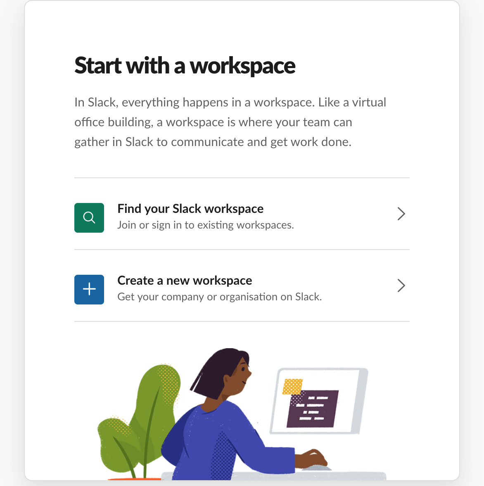

# BUILD YOUR OWN SLACKBOT 

## SUMMARY 

We are going to build a bot using node, which we will run from our own machine. It will interface with two APIs, so that when the user asks for a joke we will return the joke from the API in the slack channel.

## RESOURCES

### SLACKBOT API

Link [here](https://github.com/mishk0/slack-bot-api) , you can install this easily from command line by running `npm install slackbots` . 

This lib is very easy and practical.

## FROM SCRATCH 

Go to [here](https://slack.com) to sign up, then once you have entered your email, select `create a new workspace` 

You will then go into your slack workspace - which looks like a chat window. You have two workspaces, we want the bot to work in the general chanel. 

## CREATE THE BOT

Go to [https://api.slack.com/apps](https://api.slack.com/apps) and give the bot a name, and select your workspace name from the dropdown. 

From the `basic information` tab on the left hand side, we then select `bots` followed by `add bot user`